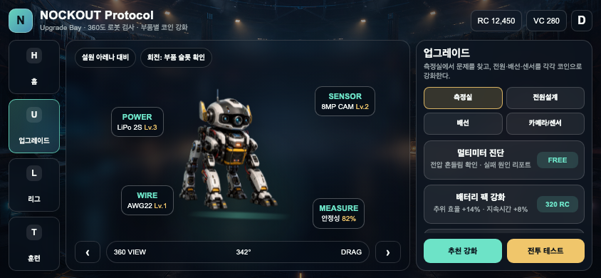

# Unity UI Prototype v01

Landscape mobile UI prototype for the NOCKOUT Protocol garage/loadout flow.

## Direction

- No player protagonist is fixed.
- Player owns multiple combat bots and support bots.
- Match loadout is `1 combat bot + up to 3 support bots`.
- Support bots act like maintenance/pet-style companions between fights.
- Initial support bot types:
  - Wheeled basic maintenance bot
  - Quadruped recovery/retrieval bot
  - Biped precision tuning bot

## UI Flow

- Home: current combat bot and support bot lineup
- Upgrade: combat bot parts and measurement room
- Maintenance room: support bot customization
- League: ranking/loadout score preview
- Training: future controls/tutorial area

## Unity Package

Source files:

```text
unity-ui-prototype/Assets/NockoutUIPrototype
```

Importable package:

```text
package-downloads/nockout_ui_prototype.unitypackage
```

Preview:


